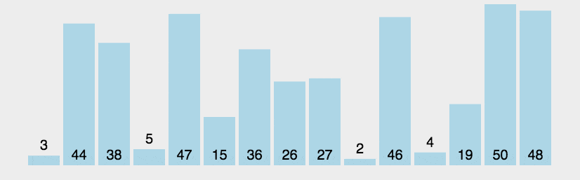

# 中国可转债市场之谜

- 定义：

  - 可转换公司债券（以下简称“可转债”）是一种兼具债权和股权性质的混合金融工具，近年来已成为我国上市公司重要的融资渠道。

- 现象与事实：我国可转债市场“可转债高转股之谜”。

  只有绝大部分可转债发行公司的股票价格在可转债存续期间迅速上涨并维持高位，我国可转债市场才可能系统性地表现出高转股特征。然而，在半强式有效市场中，股票价格在理论上应服从随机游走（法玛，1995），不应有此规律性的表现。尤其是在中国A股市场“牛短熊长”的现实背景下，特征各异、发行时点不同的可转债发行公司更是难以天然地呈现此系统性现象。因此，在公司未来股价上涨充满不确定性的情况下，A股公司所发行可转债的转股比例与转股耗时本应难以事前依据现有理论做出预判，但最终却呈现出系统性的、与欧美成熟市场实践迥异的高转股现象，这在进行系统研究之前是难以解释的，故本文称其为“可转债高转股之谜”。

- 原因分析：

- 制度原因：我国可转债的利息条款、转股价下修条款以及回售条款在不同程度上反映乃至强化了可转债发行公司的促转动机。

  （1）我国可转债“低利率、前低后高”的票面利率特征反映出发行公司的促转动机。

  （2）我国可转债普遍设置的回售条款增强了发行公司的促转动机。

  （3）我国可转债普遍设置的下修转股价条款进一步彰显了公司希望投资者债转股的事前意图。

  其次，在促转动机存在的基础上，我国可转债普遍设置的有条件赎回价格条款大大增强了发行公司促转动机的实现能力。

- 股东在存续期间，他们喜欢用一些利好消息或者是减少利空消息来促使股价上涨。然后再让。这个投资者去转股。这样他们这笔钱就不用还了

- 国外没有下修条款

研究问题：

公司发行可转债→可转债T+0交易→频繁交易、交易热度↑→溢价折价操作（既操作债也操作股）→股票交易量↑→股价上涨

股价上涨到一定程度。公司可以选择是否对可转债进行强赎。强赎之后，股民和投资者就要把债券转换成股票，一般来说，如果不强赎呢？可转债就继续进行继续上涨

一般来说，是否进行强赎这个行为和公司本身有很大关系，好公司一般不会强赎。一些资质差的公司知道自己的股价维持不了那么久，所以他会选择强赎。这种公司就其实相对恶心，类似刘劲松（2025）这种机制，就是故意拉高价格，让股民去转股，这样自己不用还钱。

经济直觉：

股东们是不想还钱的，只想借钱

我国可转债制度背景与高转股特征事实

嗯，当然有其他原因啊，我说一个我观察的比较多的就是一个公司一旦发行了可转债，因为可转债是T+0。交易的，所以说交易热度会很高。嗯，然后通过转债的这个交易，然后他很多人去做这个溢价折价的这个操作，最终呢，他有可能会既操作。可能债也操作正股，最终就让整个。这个股票的交易量上涨，最终带动整体的这个价格的上涨

一般来说。一般来说这个是否进行强赎这个行为啊。和公司本身是有很大关系的，好公司一般不会强手。一些资质差的公司知道自己的股价维持不了那么久，所以他会选择抢收。这种公司就其实相对恶心，就是刚刚文中提到的这种。这种机制吧。就是他故意想拉高价格，让股民去转股，这样自己不用还钱

2

如果你去做客转债研究，我建议有一个研究课题

就是有时候股价上涨到一定程度。公司可以选择是否对可转债进行强赎。强熟之后。股民。投资者就要把债券转换成股票，一般来说，如果不强势呢？嗯。可转债就继续进行继续上涨

2023年3月，发行30亿元规模可转债，转股价格8.16元，回售触发价5.71元，强赎触发价10.61元。

可转债强赎指当正股价格连续30个交易日中至少15个交易日收盘价不低于当期转股价格的130%时，发行人有权按面值加利息强制赎回未转股的可转债，本质是促使投资者转股以减轻债务负担。近期强赎触发比例持续高于50%，2025年Q3共有112只转债触发强赎，61只公告实施赎回，赎回节奏显著加快。强赎公告后，转债价格常因估值压缩而快速下跌，但若转股稀释率低于5%且正股强势，可能出现短期脉冲上涨，需警惕高价转债的非理性溢价风险。

（一）我国可转债制度背景

（二）我国可转债高转股的特征事实

通过梳理我国可转债市场的制度背景和实践特征，可以发现我国绝大部分可转债能在较短时间内完成转股而退市，具有浓厚的中国特色。

理论分析与研究假说

3

（一）可转债促转动机的存在性分析

首先，促成可转债投资者债转股有利于公司规避可转债回售或到期时的本金偿付，降低公司财务危机成本。

其次，促成可转债投资者债转股有利于节约利息支出。

当然，公司促成可转债投资者债转股也存在一些成本。

可转债投资者转股可能导致公司丧失可转债利息的节税收益。

但是整体而言，本文认为，相较于有限的促转成本，可转债发行公司在可转债存续期间的促转收益会更大。

（二）可转债促转动机与公司策略性信息披露

首先，公司实现促转动机的关键前提是股价的上涨，因此可转债促转动机会驱动公司产生提振股价的需求。

其次，当公司在“战略”层面决定通过提振股价来实现可转债促转目标后，接下来需要从“战术”层面权衡各种促转手段的成本与收益。在众多市值管理方式中，策略性信息披露具有显著的比较优势，表现为“不影响实施效果的同时伴随相对较低的实施成本”。因此，本文认为公司更倾向于将策略性信息披露作为主要的促转手段。

常见的策略性信息披露的表现形式包括：（1）信息披露时机的策略性选择，即提前披露好消息或推迟披露坏消息。

（2）信息披露时点的策略性选择，如在交易日披露好消息、非交易日披露坏消息。

（3）信息披露内容的策略性选择，如自愿披露好消息，隐藏或弱化坏消息。

（4）信息披露频次的策略性选择，即反复披露同一好消息，而将坏消息集中捆绑披露。

（5）信息披露文本表述的策略性选择，即在相同内容的情况下用词用语更加积极。

从实施成本来看，相较于股票回购、股息分配和并购重组等市值管理真实行为，策略性信息披露行为的实施成本相对更低。

因此，若可转债发行公司具有强烈的促转动机，本文预期其在可转债存续期间会异常释放更多净利好消息，以稳定和提振公司股价。

研究假说：相较于不在可转债存续期间的公司，处在可转债存续期间的公司会异常披露更多净利好消息。

研究设计

4

模型设计：

$$
AbNews = α + βCB + γControls + FirmFEs + MonthFEs+ε
\tag{1}
$$

被解释变量：净利好消息数量（公司实施的各类策略性信息披露最终表现为利好消息的异常增多、利空消息的异常减少。）

解释变量：当公司为可转债发行公司，且当月处在其可转债成功发行月及以后未退市的月份，CB则赋值为1，否则赋值为0。

实证检验结果

5

（一）假说检验结果

（1）发行公司在可转债存续期内倾向于异常披露更多净利好消息。

这一行为模式与促转动机理论的核心逻辑相契合：当公司具有较强的促转动机时，会主动加大策略性信息披露力度，以实现促转目标。

（2）可转债存续期间公司不仅显著增加了利好消息的异常披露，同时也减少了利空消息的披露。

这进一步印证了公司策略性信息披露行为的双重路径：既通过强化正面信息引导市场预期，也通过压缩负面信息来稳定投资者信心，从而实现促转目标。

假说得到验证。

（二）稳健性检验

稳健性检验通过。

机理验证与进一步分析

1.可转债发行规模的调节效应

可转债发行规模越大的公司，具备更强的促转动机。

2.可转债票面利率的调节效应

票面利率较高的公司，具备更强的促转动机。

3.偿本付息能力

偿本付息能力较弱的公司，具备更强的促转动机。

4.公司税收负担的调节效应

高税收负担的公司在可转债存续期间会实施显著更少的策略性信息披露。

（二）促转行为决策机理检验

相较于市场领导者公司，市值管理真实行为实施成本较高的市场跟随者公司，在可转债存续期间的策略性信息披露显著更多。

（三）进一步分析

公司当月净利好消息的异常披露越多，可转债当月的转股价值增幅越大，当月可转债转股规模也越大。

该证据也进一步闭合了本文的理论逻辑结构，支持本文提出的“促转动机—策略性披露—资本市场反应—转股实现”的机制链条。

结论与政策建议

   基于上述发现，本文提出如下政策启示与建议，以期为监管部门优化可转债监管框架、提升市场稳定性提供参考。

第一，监管部门应强化对发行人在正股市场中信息披露行为的监测，建立可转债存续期信息披露动态监测与分类监管机制，深化跨正股与可转债的联动监测机制。

第二，建议监管部门和交易所进一步完善投资者风险警示与教育体系，从制度层面提升市场整体风险防范能力和信息透明度。

第三，资本市场投资者及其他参与主体应重视可转债促转动机诱发的策略性信息披露风险，主动提升风险识别和评估能力。

- 核心参考文献：
  刘劲松，谢德仁，涨新一：中国可转债高转股之谜——来自促转动机的解释，管理世界，2025年第10期

  张郁等博士毕业论文

可转债的强赎触发条件主要包括股票价格持续高于转股价的特定比例和未转股余额低于一定金额。

### 强赎的定义

[可转债强赎（强制赎回）是指在满足特定条件下，上市公司有权按照约定价格提前赎回未转股的可转债。这一条款通常在可转债的募集说明书中明确规定，强赎是发行人的权利，而非义务。 ](https://zhuanlan.zhihu.com/p/17412695816)

### 常见的强赎触发条件

1. [**价值类强赎**：在转股期内，上市公司股票在连续30个交易日中，至少有15个交易日的收盘价格不低于当期转股价格的130%。 ](https://caifuhao.eastmoney.com/news/20250819145829554513240)

- 例如，如果某可转债的转股价为20元，若正股在30个交易日内有15天收盘价≥26元，则可能触发强赎。

1. [**余额类强赎**：可转债未转股的余额低于3000万元时，发行人有权决定强制赎回。 ](https://caifuhao.eastmoney.com/news/20250819145829554513240)

### 实施流程

- [一旦满足强赎条件，上市公司需发布公告，赎回日与触发日之间的间隔通常不少于15个交易日且不超过30个交易日。 ](https://zhuanlan.zhihu.com/p/17412695816)

  

- [投资者需在赎回登记日前完成转股或卖出操作，否则将按面值加利息被强制赎回，可能造成损失。 ](https://caifuhao.eastmoney.com/news/20250819145829554513240)

[投资者在可转债强赎公告发布后，需警惕市场价格波动，及时做出转股或卖出决策，以避免因赎回价格低于市场价而造成的损失。 ](https://finance.sina.com.cn/roll/2025-09-02/doc-infpahpm7074267.shtml)

通过了解可转债的强赎条款及其触发条件，投资者可以更好地应对市场变化，做出合理的投资决策。

## 2. 动图演示

