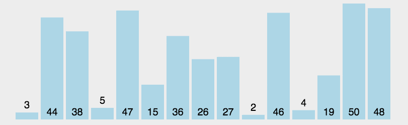

# 宏观经济与微观主体的行为互动

- Topic.1. 企业部门

  - 公司金融与资本市场

    - **市盈率（PE）**

      1）定义：市盈率是股票每股市价与[每股盈利](https://zhida.zhihu.com/search?content_id=254259914&content_type=Article&match_order=1&q=每股盈利&zhida_source=entity)的比率。

      2）计算公式：**市盈率 = 每股市价 / 每股盈利**

      3）举例：某公司股票当前市价为20元，其最近一年的每股盈利为2元，那么市盈率 = 20 / 2 = 10。它主要反映投资者为每单位盈利所支付的价格。从直观角度看，如果市盈率是10，意味着投资者愿意为每1元的盈利支付10元。

      **2.** **市净率（PB）**

      1）定义：市净率是股票每股市价与[每股净资产](https://zhida.zhihu.com/search?content_id=254259914&content_type=Article&match_order=1&q=每股净资产&zhida_source=entity)的比率。

      2）计算公式：**市净率 = 每股市价 / 每股净资产**

      3）举例：一家公司的股票市价为15元，每股净资产为5元，那么市净率 = 15 / 5 = 3。它主要衡量股票价格相对于公司净资产的价值。简单来说，市净率可以理解为投资者为每单位净资产所支付的价格，市净率为3表示投资者为每1元净资产支付3元。

      总资产回报率（又称：总资产净利率）：Return On Assets,缩写为ROA。

      ROA=（税后净利润+利息开支）/总资产*100%=销售利润率*资产周转率。

      **例：**某公司2019年总资产569.3亿元，税后净利润8亿元，利息开支3.6亿。ROA=（8+3.6）/569.3*100%=2.04%。(下图为某司的ROA、ROE对比)

      净资产收益率(又称：权益净利率)：Return On Equity,缩写为ROE。

      **1.3ROI，它是公司从一项投资活动中赚的利润率。**

      投资回报率：Return On Investment，缩写为ROI。

      ROI=税前年利润/投资总额*100%。

      **例：**某公司2019年投资性房地产税前月租5万元，按揭月利息2.8万，每月物业费0.8万元，首期房款520万，按揭贷款1080万。

      ROI=（税前月租-按揭月息-每月物业费）×12÷（首期房款+按揭贷款）

      =（5-2.8-0.8）*12/(520+1080)*100%

      =1.05%。

- **Return on Equity (ROE)** = Net Income / Average Shareholders’ Equity

- **Return on Assets (ROA)** = Net Income / Average Assets

- **Return on Invested Capital (ROIC)** = NOPAT / Average Total Debt + Equity + Other Long-Term Funding Sources

- **股本回报率（Return on Equity ,ROE）** =净收入/平均股东权益

- **资产回报率（Return on Assets,ROA）** =净收入/平均资产

- **投资资本回报率 (Return on Invested Capital,ROIC)** = NOPAT / 平均总债务 + 股权 + 其他长期资金来源

- Return on Assets (ROA):

  - Walmart: 6.5%
  - Costco: 7.2%
  - Target: 6.5%
  - Kroger: 4.4%

- Return on Equity (ROE):

  - Walmart: 8.9%
  - Costco: 26.6%
  - Target: 25.5%
  - Kroger: 41.8%

- Return on Invested Capital (ROIC):

  - Walmart: 10.4%
  - Costco: 14.9%
  - Target: 10.6%
  - Kroger: 7.3%

## 投资资本回报率（Return on Invested Capital,ROIC）

**公式：** ROIC = NOPAT/投资资本

投资资本回报率 (ROIC) 等于净经营利润 (NOPAT) 除以已投入资本。净经营利润是指公司扣除债务支出（例如支付利息）和利息收入后的净收入。已投入资本是指公司的总债务和已发行股本。

**重要性：**该比率衡量一家公司如何有效地以盈利的方式配置资本。换句话说，它告诉我们公司如何有效地利用其资本来创造利润和股东价值。

**加权平均资本成本 (WACC)**向投资者展示了一家公司为其业务融资的成本。当 ROIC 超过 WACC 时，该业务创造了股东价值。如果 ROIC 低于 WACC，则该业务正在损害股东价值。

**投资者注意：**这是一个更复杂的计算公式。ROIC 可能受到非运营因素的影响，并可能忽略整体资本效率。

## 资本使用回报率（ROCE,Return on Capital Employed）

**公式：** ROCE = EBIT/（总资产-流动负债）

已动用资本回报率 (ROCE) 是将息税前利润[(EBIT](https://www.longtermmindset.co/articles/blog/ebitda-explained-simply) ) 除以总资产与流动负债之差得出的。资产是指公司拥有的任何有价值的财产。流动负债是指下一年度到期的账单。这可能包括拖欠工人的工资、拖欠供应商的款项以及拖欠政府的税款。

息税前利润 (EBIT) 列于[损益表](https://www.longtermmindset.co/articles/blog/the-income-statement-explained-simply)中。资产和流动负债均列于资产负债表中。

**重要性：**该比率衡量公司如何有效地利用其可用资本（股权和债务）来创造利润。

**投资者注意：** ROCE 可能会因高债务水平而产生偏差，并且无法有效进行比较（这就是为什么你不会看到它像此列表中的其他比率那样频繁使用的原因）。

**市盈率PE** (Price-to-Earning Ratio)：指当前总市值除以一年的总净利润。**市盈率越低，说明越是低估**

**市净率 PB** (Price-to-Book Ratio)：指每股股价除以每股净资产，或总市值除以净资产。**1倍以下就是低市净率。**

**净资产收益率ROE**（Rate of Return on Common Stockholders’ Equity）：是指净利润除以净资产。代表着股东股权投资的报酬率，代表着公司赚钱的能力。按照格雷厄姆的标准，**盈利收益率大于10%才是值得投资的企业**。

**股息率（Dividend Yield Ratio）**：是一年的总派息额与当时市价的比例。

**PE/PB百分位**：这个指标是跟历史数据比较，看看现在的数据是在一个什么区域。**百分位5%，代表现在的估值比过去95%的时间低。**

1.静态市盈率PE (LYR) ：Last Year Ratio，以当前总市值，除以**去年一年**的总净利润。

2.滚动市盈率PE (TTM)：Trailing Twelve Months，以当前总市值，除以**前面四个季度**的总净利润。

**ROE = 股东权益回报率 = 净收入 / 股东权益**

- *股东权益 = 总资产 - 总负债*
- *巴菲特说过很多关于 ROE 对他有多重要的事。*

**ROA = 资产回报率 = 净收入 / 总资产**

- *ROA 考虑了公司有多少债务杠杆，因为总资产 = 股东权益 + 总负债。*

**ROIC = 投入资本回报率 = 税后净营业利润 (NOPAT) / 投入资本**

- *似乎有各种各样的方法来计算投入资本（我觉得有点让人困惑），所以* [*这里*](https://www.investopedia.com/terms/r/returnoninvestmentcapital.asp) *是 Investopedia 上关于 ROIC 的指南，如果你想进一步阅读的话。*
- *巴菲特也经常谈论使用 ROIC。*

**ROCE = 资本回报率 = 税前利润 (EBIT) / 投入资本**

- *EBIT 也被称为营业利润。*
- *投入资本 = 总资产 - 流动负债*（虽然我认为还有其他公式）

国有企业的市净率(PB)显著低于民营企业，但市盈率(PE)显著高于民营企业

- EVA

  

## 动图演示

 