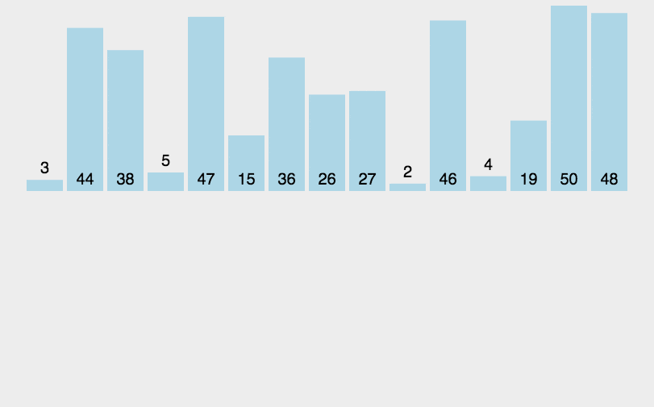

# 黄金交易税的宏观经济效应及其传导机制

黄金税收的终极结论》：大央行认为黄金一定会涨！！！

下面说一下该政策目的：
央行+财政部+税务局=大央行
这个大央行一年购金44吨
中国一年金条消费量500吨，金饰消费量350吨，

纳税所得350*0.07+500*0.13=89吨
--------------------------

目的①：创收

在无任何付出资金及外汇成本的情况下，大央行一条政策就可以一年创收2倍于自己一年的购入量
--------------------------

目的②：防止挤兑、防止散户推高成本
全世界实物黄金的进口量中国占据了44%，是推高成本的主要推手

而中国民间黄金消费量达到985吨，占据了大部分占比，是推手中的推手

在实物黄金领域，散户的热情涌入严重推高了大央行的成本。
--------------------------

--------------------------

--------------------------

一个终极的结论：大央行认为黄金一定会涨！！！
所以其想尽可能多的获取实物黄金，无轮从体量方面还是时间方面，这样的

gdp是生产馒头，货币是印钱。
一般来说印钱增速和馒头增速差不多或略高。
可为啥我的钱买到的馒头越来越少[吃瓜]

- 对黄金征税，有利于扩大内需，提振消费

税收归宿理论认为，具有供给弹性的要素不承担课税的大部分冲击；当具有完全的流动性时，供给弹性是无限的。土地要素不可流动，资本可能完全流动，熟练劳动力可能具有相对流动性$^{1}$。

土地财政之所以支撑十几年，原因也在于此。现在各地对高学历人才进行安家费补贴，本质上是将劳动力的流动性给锚定。如今黄金对实物交易进行征税也是如此，但是一个前提在于防止实物黄金外流。

对于以黄金为标的虚拟资产，如期货和ETF则不征税

对于投资类黄金征收交易税13%

对于消费类黄金征收交易税13%，同时允许消费者抵扣6%，实际征收7%。

---

$^{1}$斯蒂格利茨，公共部门经济学，中国人民大学出版社

## 2. 动图演示

 

 