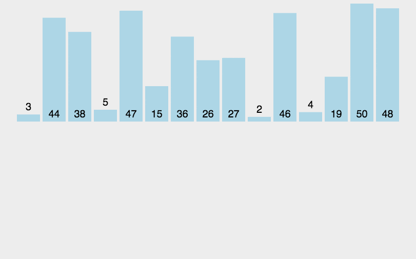

# 药店的地域分布密度与医疗保险制度

医疗保险制度是指一个国家或地区按照保险原则为解决居民防病治病问题而筹集、分配和使用医疗保险基金的制度。它是居民医疗保健事业的有效筹资机制，是构成社会保险制度的一种比较进步的制度，也是目前世界上应用相当普遍的一种卫生费用管理模式。

  我国的基本医疗保障体系由城镇职工基本医疗保险、城镇居民基本医疗保险、新型农村合作医疗和城乡医疗救助制度共同构建而成。自1997年至今，政府部门加大医疗保障制度建设力度，基本医疗保障制度取得突破性进展，成为世界上最大的医疗保障制度。但不可避免地，由于我国人口众多、区域经济发展水平不一，在实践中仍存在一些局限性，如**保障水平总体不高，人群待遇差距较大、适应流动性方面不足、保证可持续性方面不足**等问题。

  同时，医疗保障也与医药卫生事业直接相关、相互影响———医疗保障功能必须通过购买医疗服务来实现，而在医疗保障购买服务的过程中，也将对医药卫生事业的发展起到促进作用。一方面，**医疗保障体系的不断健全，将为国民健康提供稳定资金来源，这些资金最终全部通过购买服务的方式转化为医疗卫生机构的收入，为医疗卫生事业发展提供稳定的资金来源**；另一方面，医疗保障机构作为全体参保人员利益代表，在购买医药服务的过程中，将**发挥对医疗机构的监督、制约、引导作用，有利于形成外部制衡机制，规范医疗服务行为，促进医药卫生体制改革和医疗机构加强管理**。

  为助力相关研究，CnOpenData推出**中国医保定点服务机构数据，包含全国范围内的定点医疗机构、定点零售药店、医保机构等信息。为便于学者使用，CnOpenData还精准识别了各表内医药机构的经纬度坐标，并提供了省市县三级行政区划的格式化信息。**

—— 本文摘自中国开放数据CnOpenData [中国医保定点服务机构数据](https://www.cnopendata.com/data/m/food&medical/chs-serv.html) 转载请注明出处。

## 数据规模

—— 本文摘自中国开放数据CnOpenData [中国医保定点服务机构数据](https://www.cnopendata.com/data/m/food&medical/chs-serv.html) 转载请注明出处。

## 3. 动图演示

