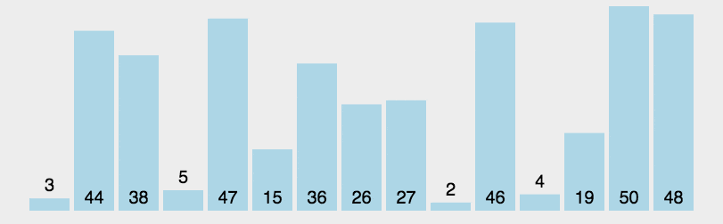

# 中国宏观杠杆率的动态演进：趋势、分解与结构

2005年以来，家庭部门和政府部门的杠杆率整体波动上升。2015年以前，政府部门的杠杆率略高于家庭部门，2015年之后，家庭部门的杠杆率则高于政府部门，直到2024年，二者有区域收敛。家庭部门负债率和公共部门负债率的**分化**，背后隐含着某些经济学原理，并且深刻反应中国宏观经济结构的变迁。

<strong>图1 居民与政府部门的杠杆率</strong>

### 1. 政府部门杠杆结构

<strong>图2  政府杠杆率结构</strong>

### 2.企业部门杠杆率

<strong>图3  政府杠杆率结构</strong>

<strong>图4  企业部门杠杆率</strong>

<strong>图5  宏观资产负债率</strong>
 

## 2. 动图演示

